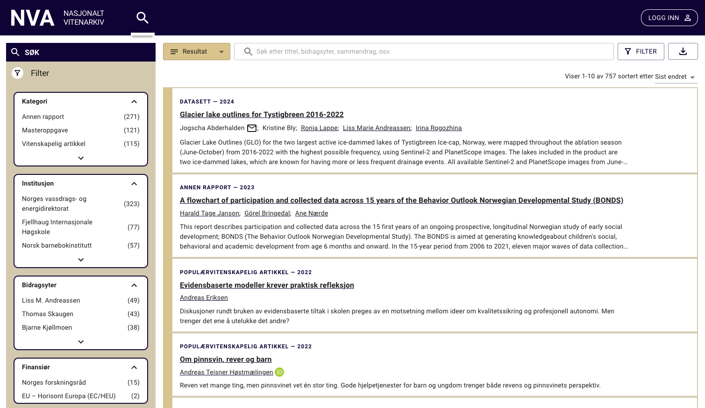

# Vårrengjøring

Vi skal gjøre en liten vårrengjøring og bygge opp forsidekomponente våre på nytt. Vi har en liste med registreringer, sortering og et filter i toppen som skal lages ut i fra angitt design.



Vi har satt opp skjelettet, en util-fil og tilbyr et api for registreringer.
Kravene til komponentene er som følger:

Registreringsliste:
- Hvert element i listen skal inneholde
    - Type registrering
    - Registreringsdato
    - Tittel
        - Print registrerings-id i konsollen onClick
    - Bidragsytere
        - Sorteres alfabetisk
    - Sammendrag
        - Ekspandere/minimere?
- Komponenten(e) skal ha egnede tester (for inspirasjon, se tester for Header og Footer)
- Universell utforming skal være ivaretatt (aria-label, tastaturnavigering)

Sortering:
- Skal kunne sortere på registreringsdato ascending og descending
- Universell utforming
- Egnede tester

Filter:
- Ledetekst
- Filtrering på tittel og sammendrag
- Universell utforming
- Egnede tester

Knapper:
- Filter- og nedlastningsknappen trenger ikke gjøre noe, men pass på at de flyter godt i skjermbildet 
  - Hint: mobil-view

## Scripts
```npm start```

```npm test```